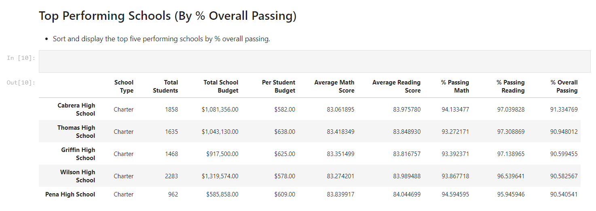

# pandas-challenge
The goal of this challenge was to aggregate sample data about a fictional school system to provide performance metrics and possible drivers of those metrics such as budget, school type, and school size. This was accomplished using Pandas in a Jupyter notebook.  

Here's an example DataFrame that was generated:

To view the results please follow the directions below: 
(you must have python and jupyter notebooks installed)

1. Clone this repo
2. Open a Git Bash or Terminal window at the repo folder
3. Type `jupyter notebook` and hit `enter`
4. Open the `main.py` notebook 
5. Select the `Cell` dropdown menu and then choose `Run All`

To view the data sources, please open the two csv files that can be found in `Resources`. 

  ---  
  
Daniel Kogel  
dkogel123@gmail.com  
www.linkedin.com/in/daniel-kogel  

